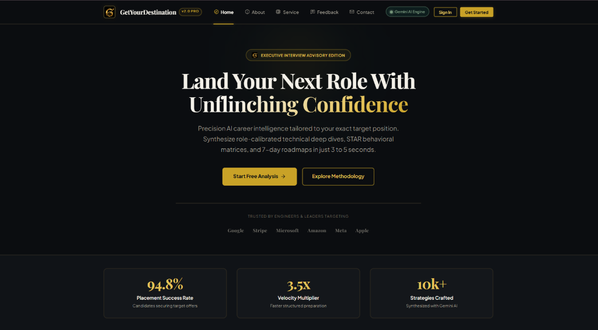
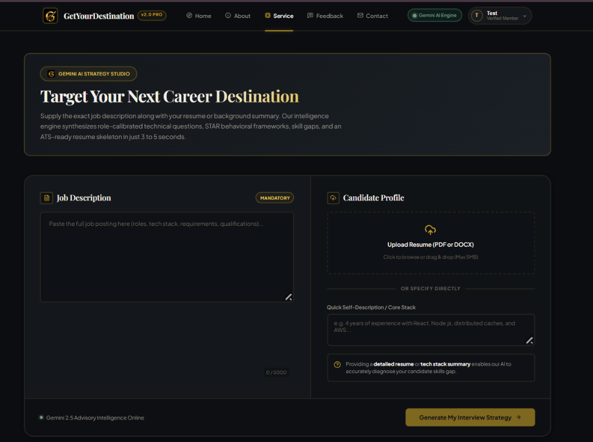
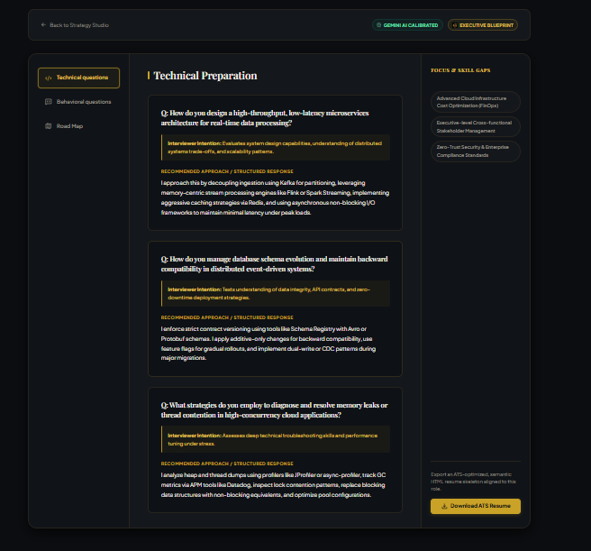
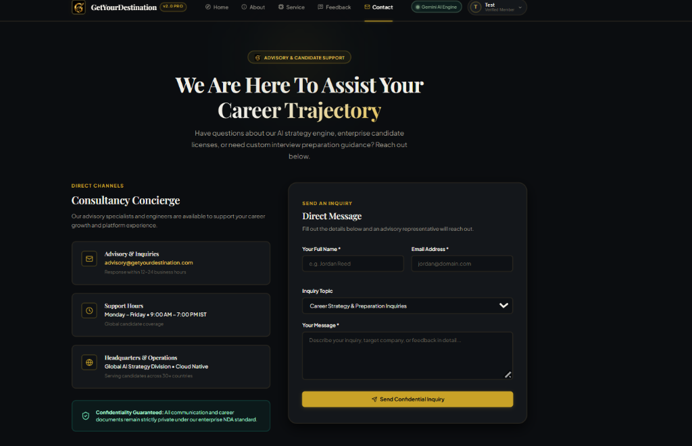
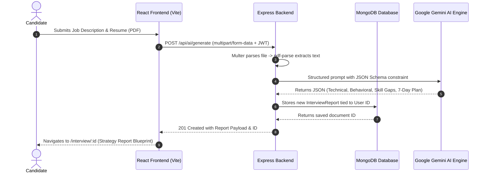

# 🌟 GetYourDestination — Executive AI Interview Strategy Platform

<div align="center">

[](https://opensource.org/licenses/ISC)
[](https://react.dev/)
[](https://vitejs.dev/)
[](https://nodejs.org/)
[](https://expressjs.com/)
[](https://www.mongodb.com/)
[](https://ai.google.dev/)
[](https://github.com/Akhilkumar4464/GetYourDestination)

<br />

**Land Your Next Role With Unflinching Confidence.**  
Precision AI career intelligence tailored to your exact target position. Synthesize role-calibrated technical deep dives, STAR behavioral frameworks, skill gap analyses, and 7-day roadmaps in just 3 to 5 seconds.

<p align="center">
  <a href="#-visual-showcase">View Screenshots</a> •
  <a href="#-key-features">Key Features</a> •
  <a href="#-system-architecture">System Architecture</a> •
  <a href="#-tech-stack">Tech Stack</a> •
  <a href="#-getting-started">Getting Started</a> •
  <a href="#-api-endpoints">API Endpoints</a>
</p>

</div>

---

## 📸 Visual Showcase

### 1. Landing Page — Executive Editorial Experience
An editorial hero section built with an **Obsidian & Gold** luxury aesthetic, live performance metrics (94.8% placement success rate, 3.5x velocity multiplier), candidate testimonials, and trust badges from top tech firms.

<div align="center">
  
</div>

---

### 2. AI Strategy Studio — Precision Input Workspace
Upload your resume (PDF/DOCX) or specify your core tech stack, supply the exact target job description (up to 5,000 characters), and launch the Gemini AI strategy synthesis engine.

<div align="center">
  
</div>

---

### 3. Interview Strategy Report — Calibrated Blueprint
Role-calibrated technical questions with interviewer intention analysis, STAR behavioral response blueprints, identified focus & skill gaps, daily study roadmaps, and one-click ATS resume generation.

<div align="center">
  
</div>

---

### 4. Consultancy Concierge & Support
Interactive candidate inquiries portal with response SLAs (12–24h), global coverage details, enterprise confidentiality NDA guarantees, and an expandable FAQ accordion.

<div align="center">
  
</div>

---

## ✨ Key Features

### 🧠 1. Google Gemini AI Strategy Synthesis
- **Targeted Technical Deep Dives**: Synthesizes 3 architectural, domain-specific technical questions tailored to the exact requirements of the job description, complete with *Interviewer Intention* breakdowns and high-scoring *Structured Responses*.
- **STAR Behavioral Framework**: Produces scenario-based behavioral questions paired with step-by-step STAR (Situation, Task, Action, Result) answer templates calibrated to corporate leadership principles.
- **Skill Gap Diagnosis**: Accurately compares your uploaded resume against the job description to highlight missing competencies and provide concrete remediation steps.
- **7-Day Adaptive Roadmap**: Generates an actionable day-by-day preparation schedule with recommended study topics and practice resources.
- **ATS Resume Generator**: Exports a clean, semantic, ATS-optimized HTML resume tailored directly for the target role.

### 💼 2. Candidate Workflow & Studio
- **Multi-Format Resume Ingestion**: Drag-and-drop support for PDF and DOCX resumes, powered by `multer` and `pdf-parse` on the backend.
- **Quick Self-Description Mode**: Direct input for candidates without a resume on hand, enabling fast ad-hoc strategy generation.
- **History & Strategy Archive**: Automatically saves all generated blueprints to MongoDB, allowing candidates to revisit previous reports anytime.

### 🎨 3. Luxury "Obsidian & Gold" Design System
- **Curated Palette**: Deep obsidian dark mode (`#0B0D10`), charcoal cards (`#14171B`), antique gold accents (`#C9A227`), and deep emerald status badges (`#0E3B36`).
- **Modern Typography**: High-end serif headings (`Playfair Display` / `Cinzel`) paired with geometric grotesk body typography (`Plus Jakarta Sans`).
- **Fluid Animations**: Smooth page transitions, staggered entrance variants, and micro-interactions powered by `framer-motion`.

### 🛡️ 4. Enterprise-Grade Authentication & Security
- **Stateless JWT Auth**: JSON Web Tokens stored securely with cookie & header support.
- **Token Blacklisting**: Invalidation of tokens on logout via MongoDB blacklist model.
- **Password Security**: Strong hashing with `bcryptjs` and real-time 4-tier password strength indicator on registration.
- **Demo Login**: Instant one-click test credentials for evaluators and recruiters.

---

## 🏗️ System Architecture

GetYourDestination is structured as a modern full-stack decoupled MERN application:

```
GetYourDestination/
├── backend/                  # Express.js REST API & AI Engine
│   ├── src/
│   │   ├── config/           # Database & environment configurations
│   │   ├── controllers/      # Request handlers (authController, aiController)
│   │   ├── middleware/       # Auth (JWT verification) & Multer file upload
│   │   ├── models/           # Mongoose schemas (User, InterviewReport, Blacklist)
│   │   ├── routes/           # REST endpoints (/api/auth, /api/ai)
│   │   └── serivces/         # Core business logic (ai.service.js with Gemini failover)
│   ├── app.js                # Express app setup & CORS middleware
│   └── server.js             # HTTP server bootstrap & MongoDB connection
│
├── frontend/                 # React 19 + Vite Frontend SPA
│   ├── public/               # Static assets & brand icons
│   ├── src/
│   │   ├── components/       # Shared reusable UI elements (Buttons, Badges, SEO)
│   │   ├── features/         # Domain-driven feature modules
│   │   │   ├── Auth/         # Login, Register, Protected routes, Auth Context
│   │   │   ├── interview/    # Strategy Studio (Service.jsx) & Report (Interview.jsx)
│   │   │   └── marketing/    # Landing (Home.jsx), About.jsx, Feedback.jsx, Contact.jsx
│   │   ├── app.routes.jsx    # React Router v7 configuration
│   │   ├── index.css         # CSS Variables token design system
│   │   └── main.jsx          # React DOM entry point
│   └── vite.config.js        # Vite build tool configuration
│
└── docs/images/              # High-resolution screenshots for documentation
```

### AI Generation Flow



---

## 🛠️ Tech Stack

### Frontend
| Technology | Description |
| :--- | :--- |
| **React 19** | Modern declarative UI component library |
| **Vite 8** | Lightning-fast development server and optimized build tool |
| **React Router v7** | Declarative client-side routing & protected route wrappers |
| **Framer Motion 12** | Production-ready motion and physics-based micro-animations |
| **Lucide React** | Consistent, sleek icon suite |
| **Sass (SCSS)** | Modular styling layered on top of CSS custom properties |
| **React Helmet Async** | Dynamic OpenGraph and SEO meta tag management |
| **Canvas Confetti** | Delightful candidate victory celebrations |

### Backend & AI
| Technology | Description |
| :--- | :--- |
| **Node.js & Express 5** | Scalable, lightweight REST API server framework |
| **Google Gemini AI SDK** | `@google/genai` multi-model synthesis engine with structured output |
| **MongoDB & Mongoose 9** | NoSQL document database for users, reports, and token blacklists |
| **Multer & PDF-Parse** | Secure multipart file upload & raw text extraction from resumes |
| **JSON Web Token (JWT)** | Stateless, token-based authentication |
| **Bcrypt.js** | Salted cryptographic password hashing |
| **Zod** | Schema definition and validation utilities |

---

## 🚀 Getting Started

### Prerequisites
- **Node.js**: v18.0.0 or higher
- **npm** or **yarn**
- **MongoDB**: Local instance running on `mongodb://localhost:27017` or a MongoDB Atlas cluster URL
- **Google Gemini API Key**: Obtainable from [Google AI Studio](https://aistudio.google.com/)

---

### 1. Clone the Repository
```bash
git clone https://github.com/Akhilkumar4464/GetYourDestination.git
cd GetYourDestination
```

---

### 2. Backend Setup
```bash
# Navigate to backend directory
cd backend

# Install dependencies
npm install

# Create environment configuration file
cp .env.example .env # or create .env manually
```

Configure your `.env` in the `backend/` directory:
```env
PORT=3000
MONGO_URI=mongodb://localhost:27017/getyourdestination
JWT_SECRET=your_jwt_secret_key_here
GEMINI_API_KEY=your_gemini_api_key_here
GEMINI_MODEL=gemini-3.7-flash
FRONTEND_URL=http://localhost:5173
```

Start the backend development server:
```bash
npm run dev
# Server will start on http://localhost:3000
```

---

### 3. Frontend Setup
```bash
# Open a new terminal and navigate to frontend directory
cd frontend

# Install dependencies
npm install
```

Configure your `.env` in the `frontend/` directory:
```env
VITE_API_URL=http://localhost:3000
```

Start the Vite development server:
```bash
npm run dev
# Frontend will be accessible at http://localhost:5173
```

---

## 📡 API Endpoints

### Authentication (`/api/auth`)
| Method | Endpoint | Access | Description |
| :--- | :--- | :--- | :--- |
| `POST` | `/api/auth/register` | Public | Register a new user account |
| `POST` | `/api/auth/login` | Public | Authenticate user & return JWT token |
| `GET` | `/api/auth/logout` | Public | Invalidate current JWT token |
| `GET` | `/api/auth/me` | Private | Retrieve currently authenticated user profile |

### AI Strategy Engine (`/api/ai`)
| Method | Endpoint | Access | Description |
| :--- | :--- | :--- | :--- |
| `POST` | `/api/ai/generate` | Private | Generate interview strategy report from resume/job description |
| `GET` | `/api/ai/my-reports` | Private | Fetch all historical strategy reports for logged-in user |
| `GET` | `/api/ai/:interviewId` | Private | Fetch a single detailed strategy report by ID |

---

## 🛡️ Gemini AI Fallback Architecture

To ensure 99.9% uptime and prevent service interruption during peak load or model deprecation cycles, the AI service features an automated multi-model candidate failover pipeline:

1. **User Defined Model**: Checks `process.env.GEMINI_MODEL` (e.g., `gemini-3.7-flash`).
2. **Next-Gen Failover**: Automatically cycles through `gemini-3.8-flash` ➔ `gemini-3.7-flash` ➔ `gemini-3.6-flash` ➔ `gemini-3.5-flash`.
3. **Smart Retry Mechanism**: Automatically retries 429 (Rate Limit) and 5xx (Temporary Server) errors with exponential backoff delay before transitioning models.
4. **JSON Schema Enforcement**: Guaranteed rigid JSON parsing with defensive fallback extraction.

---

## 📄 License

This project is licensed under the **ISC License**. See the [LICENSE](LICENSE) file for details.

---

<div align="center">
  <sub>Crafted with passion for engineers, leaders, and ambitious professionals worldwide.</sub>
</div>
